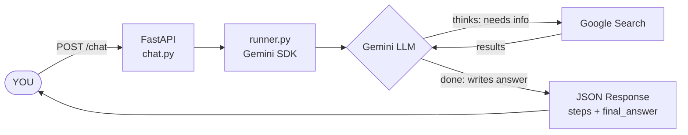
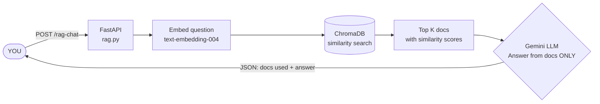
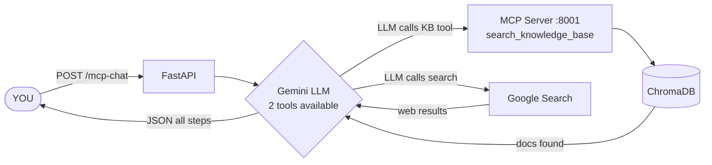
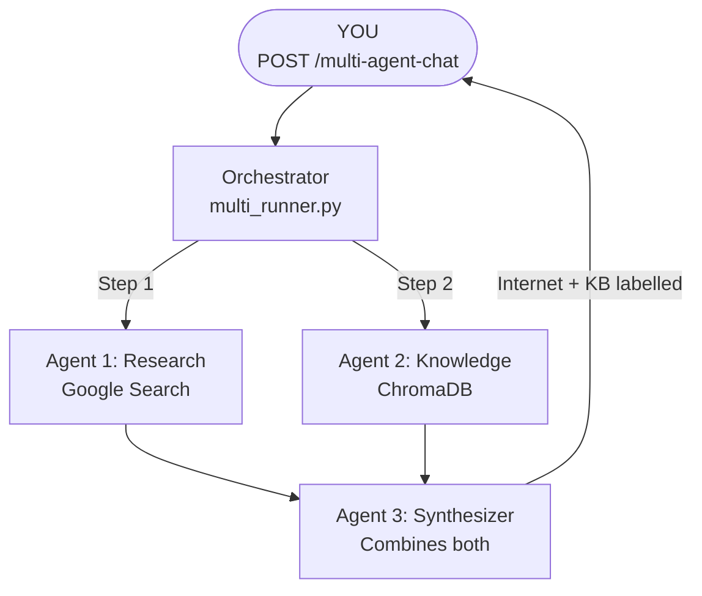

# How the Code Flows

Plain-English walkthroughs of all 4 flows with Mermaid diagrams.
GitHub renders these diagrams automatically in the browser.

Detailed SVG diagrams (each section on its own):
- [① Agent Flow](diagrams/01-agent-flow.svg)
- [② RAG Flow](diagrams/02-rag-flow.svg)
- [③④ Comparison + Code Structure](diagrams/03-comparison-code.svg)
- [⑤ MCP Flow](diagrams/04-mcp-flow.svg)
- [⑥ Multi-Agent Flow](diagrams/05-multi-agent.svg)

---

## Flow 1 — Agent flow (POST /chat)



```
Step 1  YOU send:  POST /chat  { "message": "What is the latest in AI?" }

Step 2  FastAPI receives the request.
        chat.py validates the JSON (Pydantic checks the shape).

Step 3  runner.py calls the Gemini SDK:
        client.interactions.create(model, message, tools=[google_search])

Step 4  Gemini LLM thinks (THOUGHT step — internal, silent):
        "This question needs current info. I should search Google."

Step 5  Gemini calls Google Search (GOOGLE_SEARCH_CALL step):
        Sends 1–3 search queries to the internet.

Step 6  Google returns results (GOOGLE_SEARCH_RESULT step):
        Title, URL, and snippet for each result come back to the LLM.

Step 7  Gemini thinks again (THOUGHT step):
        "I have enough. I can now write a good answer."

Step 8  Gemini writes the answer (MODEL_OUTPUT step):
        Uses the search snippets as context.

Step 9  parser.py converts each raw SDK step → a clean AgentStep object.

Step 10 YOU receive: JSON with every step visible + final_answer.
```

**Code path:**
```
chat.py → runner.py → [Gemini + Google] → parser.py → ChatResponse JSON
```

---

## Flow 2 — RAG flow (POST /documents/rag-chat)



```
Step 1  YOU send:  POST /documents/rag-chat  { "question": "What is RAG?", "top_k": 3 }

Step 2  FastAPI receives the request.
        rag.py validates the JSON.

Step 3  retriever.py embeds your question:
        "What is RAG?" → Gemini text-embedding-004 → [0.12, -0.34, ..., 0.88]  (768 numbers)

Step 4  ChromaDB receives that vector and compares it to ALL stored document vectors.
        It calculates cosine similarity (how close are the meanings?).

Step 5  ChromaDB returns the top 3 most similar documents with similarity scores.
        Example: acme-return-001 (0.94), acme-refund-004 (0.81), acme-orders-007 (0.76)

Step 6  rag.py builds a context block:
        "[Document 1 | similarity: 0.94]\nAcme return policy...\n\n[Document 2]..."

Step 7  rag.py builds the LLM prompt:
        "Answer using ONLY the context below. Do not use outside knowledge.
         Context: [the 3 documents]   Question: What is RAG?"

Step 8  Gemini reads only those 3 documents and writes an answer.
        It cannot search the internet. It cannot use its training data.
        It is constrained to YOUR documents.

Step 9  YOU receive: JSON with retrieved_documents, context_used, and answer.
```

**Code path:**
```
rag.py → retriever.py → ChromaDB → (back to rag.py) → Gemini generate_content() → RagResponse JSON
```

---

## When you add a document (POST /documents)

```
Step 1  YOU send:  POST /documents  { "text": "Acme returns: 30 days, original packaging.",
                                      "metadata": {"topic": "returns"} }

Step 2  retriever.py receives the text.

Step 3  GeminiEmbeddingFunction calls Gemini text-embedding-004:
        "Acme returns: 30 days..." → [0.45, 0.12, ..., -0.23]  (768 numbers)

Step 4  ChromaDB saves three things together:
        • The original text (so you can read it back)
        • The 768-number vector (so it can be searched by meaning)
        • Your metadata (topic, source, etc.)
        All saved to the chroma_db/ folder on disk.

Step 5  YOU receive: { "doc_id": "abc123", "message": "Document added" }
        Next time someone asks "Can I return an item?", this document will be retrieved.
```

**Code path:**
```
rag.py → retriever.add_document() → store.GeminiEmbeddingFunction → ChromaDB (chroma_db/ on disk)
```

---

## Flow 3 — MCP flow (POST /mcp-chat)



```
Step 1  YOU send:  POST /mcp-chat  { "message": "What is RAG? Also any AI news today?" }
        Two terminals must be running: FastAPI on :8000 AND MCP server on :8001.

Step 2  FastAPI receives the request.
        mcp_chat.py sets tools = [google_search, mcp_server(url=localhost:8001/mcp)]

Step 3  runner.py calls the Gemini SDK with BOTH tools available.

Step 4  Gemini LLM thinks (THOUGHT step):
        "RAG is probably in the knowledge base. AI news needs internet. I'll use both."

Step 5  Gemini sends an MCP call to your server (MCP_SERVER_TOOL_CALL step):
        → HTTP request to http://localhost:8001/mcp
        → Function: search_knowledge_base(query="RAG", top_k=3)

Step 6  Your MCP server (mcp_server/server.py) receives the call.
        It runs retriever.search("RAG") → ChromaDB → returns top 3 documents.
        Results are sent back to Gemini via MCP protocol (MCP_SERVER_TOOL_RESULT step).

Step 7  Gemini also calls Google Search (GOOGLE_SEARCH_CALL step):
        Searches for "AI agent news 2026".
        Gets results back (GOOGLE_SEARCH_RESULT step).

Step 8  Gemini thinks again (THOUGHT step):
        "I now have KB results + internet results. Time to write the answer."

Step 9  Gemini writes the final answer (MODEL_OUTPUT step):
        Uses BOTH the ChromaDB documents AND the search results.

Step 10 parser.py converts all steps (including the new MCP step types).

Step 11 YOU receive: JSON with every step visible. You can see exactly when
        the LLM chose ChromaDB vs Google Search.
```

**Code path:**
```
mcp_chat.py → runner.py → [Gemini decides] → mcp_server/server.py → retriever.py → ChromaDB
                                            → Google Search
                          → parser.py → ChatResponse JSON
```

**How MCP server exposes tools (mcp_server/server.py):**
```
FastMCP server starts on port 8001
    exposes 3 tools the LLM can discover and call:
    • search_knowledge_base(query, top_k)  → runs retriever.search()
    • add_document_to_kb(text, topic)      → runs retriever.add_document()
    • get_kb_stats()                       → counts documents in ChromaDB

Gemini connects to http://localhost:8001/mcp
    asks: "what tools do you have?"
    gets back: the 3 function signatures above
    calls them whenever it decides to — completely autonomously
```

---

## Flow 4 — Multi-Agent flow (POST /multi-agent-chat)



```
Step 1  YOU send:  POST /multi-agent-chat  { "message": "What is RAG?" }

Step 2  FastAPI receives the request.
        multi_agent.py validates the JSON.

Step 3  multi_runner.py ORCHESTRATES the agents:

        ┌───────────────────────────────────────────────────────────────────┐
        │  AGENT 1: Research Agent                                          │
        │  Prompt: "Find current information about: What is RAG?"           │
        │  Tool: Google Search                                              │
        │  Internally: LLM thinks → calls Google → reads results → answers │
        │  Output: answer_from_internet                                     │
        └───────────────────────────────────────────────────────────────────┘
                                     ↓
        ┌───────────────────────────────────────────────────────────────────┐
        │  AGENT 2: Knowledge Agent                                         │
        │  Embeds question → searches ChromaDB → retrieves matching docs    │
        │  Tool: ChromaDB semantic search (no internet)                     │
        │  Prompt: "Answer using ONLY these documents: [docs]"              │
        │  Output: answer_from_knowledge_base                               │
        └───────────────────────────────────────────────────────────────────┘
                                     ↓
        ┌───────────────────────────────────────────────────────────────────┐
        │  AGENT 3: Synthesizer Agent                                       │
        │  Input: answer_from_internet + answer_from_knowledge_base         │
        │  Prompt: "Combine these, label each fact [Internet]/[KB]"         │
        │  Output: combined_final_answer                                    │
        └───────────────────────────────────────────────────────────────────┘

Step 4  YOU receive: JSON with all 3 agents' answers + final synthesized answer.
        Each agent's answer tells you where its knowledge came from.
```

**Code path:**
```
multi_agent.py → multi_runner.run_multi_agent()
    ├─ run_research_agent()  → runner.run_agent() → Gemini + Google Search → parser.py
    ├─ run_knowledge_agent() → retriever.search() → ChromaDB → Gemini generate_content()
    └─ run_synthesizer_agent() → Gemini generate_content() with combined prompt
    → MultiAgentResponse JSON
```

**Key difference from MCP:**
```
MCP flow:         YOU give LLM two tools → LLM autonomously decides when to call each
Multi-Agent flow: YOUR CODE decides to run 3 agents in order → you have full control
```

---

## All 4 flows side by side — key differences

| | Flow 1: Agent `/chat` | Flow 2: RAG `/rag-chat` | Flow 3: MCP `/mcp-chat` | Flow 4: Multi-Agent `/multi-agent-chat` |
|---|---|---|---|---|
| **Who decides to search?** | LLM decides | Your code always searches | LLM decides | Your code (orchestrator) |
| **Knowledge source** | Live internet | Your ChromaDB only | Both — LLM picks | Both — always uses both |
| **LLM gets context from** | Google Search results | Your retrieved docs | Both sources | Each agent gets its own context |
| **You control the flow?** | No | Yes | No | Yes |
| **Agents visible** | 1 (the LLM) | 0 (no agent steps) | 1 (the LLM) | 3 (each one's output visible) |
| **Best for** | Current events, facts | Private/company data | Mixed questions | Highest quality — transparent sourcing |
| **Needs MCP server?** | No | No | Yes (port 8001) | No |
